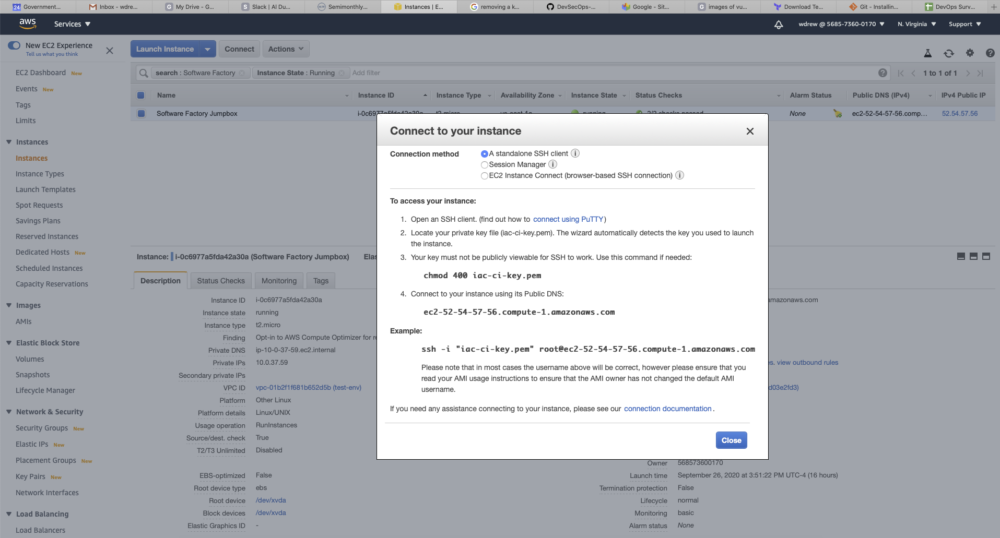

# Vulcan
 

Vulcan is the code name for the DevSecOps Center of Transformation (CoT) internal project implementing software (S/W) factories using Infrastructure as Code (IaC) and [Kubernetes](https://kubernetes.io) (K8S). 

A S/W factory comprises all the tools and processes within the supporting environments necessary for a team to develop, test and deliver a software product to their end users and evolve itself, as necessary to support the product's evolution.

The goal of Vulcan is to provision and configure all of the components and the environments in which they are hosted in a predictable, repeatable manner on a cloud platform via Infrastructure as Code (IaC). The execution of a particular set of IaC results in a desired state configuration (DSC) of all the tools, processes and environment configured and integrated without any manual intervention.

Given it's dynamic provisioning capability, cloud service providers (CSP) are the obvious target platform. The initial CSP is Amazon Web Services with other CSPs supported in future releases. 

All the components are run within containers which are deployed to K8S clusters running on AWS. The K8S clusters are provisioned via [KOPS](https://kops.sigs.k8s.io) and managed with [kubectl](https://kubernetes.io/docs/reference/kubectl/overview/). Container images for each tool are created using [Docker](https://www.docker.com). The [AWS CLI](https://aws.amazon.com/cli/) is used to connect to a user's account on AWS.

## Current State

The current state of the project is as a minimual viable product (MVP). It provides a basic DSC that a development team could use to get started. It is by no means a complete DSC but does represent the core of what one would expect of a continuous integration (CI) environment. 

Several people will be reviewing the MVP and providing feedback and recommendation on the next phases. From there we will create a plan for moving forward and providing a version of the product which we can demonstrate to a wider audience across GCIO.

## Get Started (MVP)

There a number of tools which need to be configured along with an AWS account in order to use the initial version. In order to make it simplier and standardized for the user we've created a [jump box](https://en.wikipedia.org/wiki/Jump_server) on AWS that has all of the required products already installed, configured and available.

The jumpbox instance is provisioned via [Terraform](https://www.terraform.io/downloads.html) using a base image created with [Packer](https://learn.hashicorp.com/collections/packer/getting-started). The IaC is maintained in and can be cloned from this public GitHub [repository](https://github.governmentcio.com/DevSecOps-CoT/vulcan) using [git](https://git-scm.com/book/en/v2/Getting-Started-Installing-Git).

If you want to start from scratch and create the jump box yourself, you'll need to have these tools (Git, Terraform and Packer) installed on your local machine.

## Creating the Jump Box 

First clone down the IaC to your local machine.

```bash
git clone https://github.governmentcio.com/DevSecOps-CoT/vulcan.git
```

Navigate to the directory containing the packer scripts.

```bash
cd vulcan/cluster/aws/packer
```
and execute the jumpbox-build.sh Packer script to create the base image.

```bash
./jumpbox-build.sh
```
Which should result in the following:

```
Start Time : 2020/09/26 15:25:45

amazon-ebs: output will be in this color.

==> amazon-ebs: Force Deregister flag found, skipping prevalidating AMI Name
    amazon-ebs: Found Image ID: ami-02354e95b39ca8dec
==> amazon-ebs: Creating temporary keypair: packer_5f6f95bb-4872-c37e-fb78-6fdcc3bc20d7
==> amazon-ebs: Creating temporary security group for this instance: packer_5f6f95bd-144e-7667-0a63-8cf11f5d6ce1
==> amazon-ebs: Authorizing access to port 22 from [0.0.0.0/0] in the temporary security groups...
==> amazon-ebs: Launching a source AWS instance...
==> amazon-ebs: Adding tags to source instance
    amazon-ebs: Adding tag: "Name": "Packer Builder"
    amazon-ebs: Instance ID: i-0b6abde4c33bff0a6
==> amazon-ebs: Waiting for instance (i-0b6abde4c33bff0a6) to become ready...
==> amazon-ebs: Using ssh communicator to connect: 184.73.130.171
==> amazon-ebs: Waiting for SSH to become available...
==> amazon-ebs: Connected to SSH!
==> amazon-ebs: Provisioning with shell script: ./jumpbox-setup.sh
    amazon-ebs: Executing base image setup of Software Factory Jumpbox.
    <truncated for brevity>
 ==> amazon-ebs: Creating AMI swf-jumpbox from instance i-0b6abde4c33bff0a6
    amazon-ebs: AMI: ami-0303ace71d03e2fd3
==> amazon-ebs: Waiting for AMI to become ready...
==> amazon-ebs: Adding tags to AMI (ami-0303ace71d03e2fd3)...
==> amazon-ebs: Tagging snapshot: snap-048f61a3b0a70012b
==> amazon-ebs: Creating AMI tags
    amazon-ebs: Adding tag: "component-name": "jumpbox"
    amazon-ebs: Adding tag: "Name": "Software Factory Jumpbox"
    amazon-ebs: Adding tag: "namespace": "software-factory"
==> amazon-ebs: Creating snapshot tags
==> amazon-ebs: Terminating the source AWS instance...
==> amazon-ebs: Cleaning up any extra volumes...
==> amazon-ebs: No volumes to clean up, skipping
==> amazon-ebs: Deleting temporary security group...
==> amazon-ebs: Deleting temporary keypair...
Build 'amazon-ebs' finished.

==> Builds finished. The artifacts of successful builds are:
--> amazon-ebs: AMIs were created:
us-east-1: ami-0303ace71d03e2fd3

End Time : 2020/09/26 15:32:21

Elapsed Time: 0:06:36
    
```

Navigate to the directory containing the Terraform scripts.

```bash
[ > cd ../terraform
```
First you'll need to initialize Terraform with the following:

```bash
[ > terraform init

Initializing the backend...

Initializing provider plugins...
- Checking for available provider plugins...
- Downloading plugin for provider "aws" (hashicorp/aws) 3.8.0...

The following providers do not have any version constraints in configuration,
so the latest version was installed.

To prevent automatic upgrades to new major versions that may contain breaking
changes, it is recommended to add version = "..." constraints to the
corresponding provider blocks in configuration, with the constraint strings
suggested below.

* provider.aws: version = "~> 3.8"

Terraform has been successfully initialized!
...

```

You can now execute the script to create the Software Factory Jump Box.

```bash

[ > ./create.sh 
Start Time : 2020/09/26 15:51:11

iac-ci-key already exists.
Overwrite (y/n)? aws_vpc.test-env: Refreshing state... [id=vpc-01b2f1f681b652d5b]
data.aws_ami.jumpbox-image: Refreshing state...
aws_subnet.subnet-uno: Refreshing state... [id=subnet-0ceab88e370339887]
aws_internet_gateway.test-env-gw: Refreshing state... [id=igw-0ab222282e00025f3]
aws_security_group.ingress-all-test: Refreshing state... [id=sg-010f6c45e8a6817db]
aws_route_table.route-table-test-env: Refreshing state... [id=rtb-099b6d8c80f77892c]
aws_route_table_association.subnet-association: Refreshing state... [id=rtbassoc-0c6e4654ef500aa6c]
aws_key_pair.iac-ci-key: Creating...
aws_key_pair.iac-ci-key: Creation complete after 0s [id=iac-ci-key]
aws_instance.test-ec2-instance: Creating...
aws_instance.test-ec2-instance: Still creating... [10s elapsed]
aws_instance.test-ec2-instance: Still creating... [20s elapsed]
aws_instance.test-ec2-instance: Still creating... [30s elapsed]
aws_instance.test-ec2-instance: Creation complete after 35s [id=i-0c6977a5fda42a30a]
aws_eip.ip-test-env: Creating...
aws_eip.ip-test-env: Creation complete after 1s [id=eipalloc-060febc947fb2176d]

Apply complete! Resources: 3 added, 0 changed, 0 destroyed.

Outputs:

jumpbox-ami-id = ami-0303ace71d03e2fd3

End Time : 2020/09/26 15:51:57

Elapsed Time: 0:00:46

```

You've now created an EC2 instance on AWS with the necessary supporting security and networking.

## SSH'ing to the Jump Box

Sign onto your AWS account, navigate to the EC2 page and click on the instance named "Software Factory Jumpbox". Click on the "Connect" button which will display the following connection information.



Select and copy the connection information for ssh. In the example above that would be:

```
ssh -i "iac-ci-key.pem" root@ec2-52-54-57-56.compute-1.amazonaws.com
```

Paste that into your shell inside the directory where you ran the Terraform script, removing the ".pub" extension and changing the user to "ec2-user" as shown here:

```
ssh -i "iac-ci-key" ec2-user@ec2-52-54-57-56.compute-1.amazonaws.com
```

Hit "Enter/Return" and you'll see the following:

```
 > ssh -i "iac-ci-key" ec2-user@ec2-52-54-57-56.compute-1.amazonaws.com

       __|  __|_  )
       _|  (     /   Amazon Linux 2 AMI
      ___|\___|___|

https://aws.amazon.com/amazon-linux-2/
[ec2-user@ip-10-0-37-59 ~]$ 
```
You are now on the Jump Box. 

From here you'll need to clone the IaC and supporting files to the Jump Box using the following:

```
[ec2-user@ip-10-0-37-59 ~]$ git clone https://github.governmentcio.com/DevSecOps-CoT/vulcan.git
Cloning into 'vulcan'...
Username for 'https://github.governmentcio.com': wdrew
Password for 'https://wdrew@github.governmentcio.com': 
remote: Enumerating objects: 570, done.
remote: Total 570 (delta 0), reused 0 (delta 0), pack-reused 570
Receiving objects: 100% (570/570), 37.00 MiB | 14.44 MiB/s, done.
Resolving deltas: 100% (265/265), done.
```

You'll need to configure AWS with your credentials by running 'aws configure'. Copy and paste your access key id and secret access key when prompted. This information can be retrieved from the file *credentials* in the .aws directory on your local machine. The default location is under you home directory (~/.aws). 

```
[ec2-user@ip-10-0-37-59 ~]$ aws configure
AWS Access Key ID [None]: <your access key id here>
AWS Secret Access Key [None]: <your secret access key here>
Default region name [None]: 
Default output format [None]: json
```

 Navigate into the directory vulcan/cluster/aws.
 
``` 
[ec2-user@ip-10-0-37-59 ~]$ cd vulcan/cluster/aws/
```
Which will contain the following:

```
[ec2-user@ip-10-0-37-59 aws]$ ll
total 28
-rwxrwxr-x 1 ec2-user ec2-user   69 Sep 27 13:05 bounce-cluster.sh
-rwxrwxr-x 1 ec2-user ec2-user 1815 Sep 27 13:05 create-aws-k8s-cluster.sh
-rwxrwxr-x 1 ec2-user ec2-user  209 Sep 27 13:05 create-cluster-and-base-dsc.sh
-rwxrwxr-x 1 ec2-user ec2-user  710 Sep 27 13:05 create-kops-user.sh
-rwxrwxr-x 1 ec2-user ec2-user  323 Sep 27 13:05 delete-aws-k8s-cluster.sh
drwxrwxr-x 2 ec2-user ec2-user   83 Sep 27 13:05 elk
drwxrwxr-x 2 ec2-user ec2-user  119 Sep 27 13:05 ingress
drwxrwxr-x 2 ec2-user ec2-user  102 Sep 27 13:05 packer
-rw-rw-r-- 1 ec2-user ec2-user 1587 Sep 27 13:05 README.md
-rwxrwxr-x 1 ec2-user ec2-user  640 Sep 27 13:05 set-env-vars.sh
drwxrwxr-x 2 ec2-user ec2-user  139 Sep 27 13:05 terraform
[ec2-user@ip-10-0-37-59 aws]$ 
```

Execute the ./create-cluster-and-base-dsc.sh script. You will be presented with the configuration of the K8S cluster you are about to create. Enter 'y' at the prompt to proceed.

```
[ec2-user@ip-10-0-37-59 aws]$ ./create-cluster-and-base-dsc.sh 
Creating cluster k8s-vulcan.gov-cio.com in region us-west-2 and zones us-west-2a,us-west-2b,us-west-2c with 3 t2.large nodes and t2.medium sized master node in DNS zone gov-cio.com using state store s3://k8s-vulcan.gov-cio.com.
Do you want to continue? y
```

You will receive some output from the script while creating the cluster. Once the appropriate commands have been issued to AWS to create the cluster, it will continually check on the cluster status until it's ready to use. You'll see a series of messages like the following, as the creation and validation of the cluster can take from 10-20 minutes depending on network speed.

```
Validating cluster k8s-vulcan.gov-cio.com

W0927 14:24:51.776413    4229 validate_cluster.go:173] (will retry): unexpected error during validation: unable to resolve Kubernetes cluster API URL dns: lookup api.k8s-vulcan.gov-cio.com on 10.0.0.2:53: no such host
```

Once the cluster is ready you'll receive the following.

```
Your cluster k8s-vulcan.gov-cio.com is ready
```

Followed by the execution of the IaC and provisioning of the CI tools and supporting resources:

```
namespace/ingress-nginx created
serviceaccount/ingress-nginx created
configmap/ingress-nginx-controller created
clusterrole.rbac.authorization.k8s.io/ingress-nginx created
clusterrolebinding.rbac.authorization.k8s.io/ingress-nginx created
role.rbac.authorization.k8s.io/ingress-nginx created
rolebinding.rbac.authorization.k8s.io/ingress-nginx created
service/ingress-nginx-controller-admission created
service/ingress-nginx-controller created
deployment.apps/ingress-nginx-controller created
validatingwebhookconfiguration.admissionregistration.k8s.io/ingress-nginx-admission created
clusterrole.rbac.authorization.k8s.io/ingress-nginx-admission created
clusterrolebinding.rbac.authorization.k8s.io/ingress-nginx-admission created
job.batch/ingress-nginx-admission-create created
job.batch/ingress-nginx-admission-patch created
role.rbac.authorization.k8s.io/ingress-nginx-admission created
rolebinding.rbac.authorization.k8s.io/ingress-nginx-admission created
serviceaccount/ingress-nginx-admission created
Waiting for ingress-controller pods...
pod/ingress-nginx-controller-c96557986-mwx5j condition met
service/ingress-nginx created
serviceaccount/fluentd-es created
clusterrole.rbac.authorization.k8s.io/fluentd-es created
clusterrolebinding.rbac.authorization.k8s.io/fluentd-es created
daemonset.apps/fluentd-es-v2.2.0 created
service/elasticsearch-logging created
serviceaccount/elasticsearch-logging created
clusterrole.rbac.authorization.k8s.io/elasticsearch-logging created
clusterrolebinding.rbac.authorization.k8s.io/elasticsearch-logging created
statefulset.apps/elasticsearch-logging created
deployment.apps/kibana-logging created
service/kibana-logging created
configmap/fluentd-es-config-v0.1.4 created
storageclass.storage.k8s.io/cloud-ssd created
The StorageClass "cloud-ssd" is invalid: reclaimPolicy: Forbidden: updates to reclaimPolicy are forbidden.
namespace/mongo created
storageclass.storage.k8s.io/sc-gp2 created
service/service-mongodb created
clusterrolebinding.rbac.authorization.k8s.io/default-view created
statefulset.apps/mongodb created
namespace/sonar created
secret/postgres-pwd created
persistentvolumeclaim/claim-postgres created
deployment.apps/sonar-postgres-deployment created
service/sonar-postgres created
namespace/artifactory created
deployment.apps/artifactory created
service/artifactory created
ingress.extensions/artifactory-routing created
namespace/gitlab created
deployment.apps/gitlab created
service/gitlab created
ingress.extensions/gitlab-routing created
namespace/jenkins created
persistentvolumeclaim/jenkins-volume-claim created
deployment.apps/jenkins-master-deployment created
service/jenkins created
ingress.extensions/jenkins-routing created
namespace/sonar unchanged
deployment.apps/sonarqube created
service/sonar created
ingress.extensions/sonar-routing created
[ec2-user@ip-10-0-37-59 aws]$ 

```
At the command prompt enter the following.

```
[ec2-user@ip-10-0-37-59 aws]$ kubectl get services -n ingress-nginx 

```
You should get the following list of services in the ingress-nginx namespace:

```

NAME                                 TYPE           CLUSTER-IP       EXTERNAL-IP                                                                    PORT(S)                      AGE
ingress-nginx                        LoadBalancer   100.71.70.85     a57e21c2bdf064859afe80c696557555-1358878769.us-west-2.elb.amazonaws.com         80:31477/TCP,443:32727/TCP   19m
ingress-nginx-controller             LoadBalancer   100.66.213.116   a5653f68b231c42a4a1028cace5e096e-215b75f6c0a19922.elb.us-west-2.amazonaws.com   80:31614/TCP,443:32699/TCP   19m
ingress-nginx-controller-admission   ClusterIP      100.66.107.20    <none>                                                                          443/TCP                      19m
```

Note the value of EXTERNAL-IP for the ingress-nginx-controller item which of course will be unique for your cluster. It will be used later in configuring the Route 53 alias entry.

An alias must be manually created in Route 53 in order to expose the components to the outside. Using your browser, go to your AWS account and under 'Networking and Content Delivery' click on Route 53. Click on 'Hosted Zones' under 'DNS Management' and then click on the 'devgovcio.com' entry. Click on the 'Create Record Set' button and enter the following:

```
Name: swf (should create the full name swf.devgovcio.com) 
Type: leave as A-IPv4 address
Alias: choose 'Yes'
Alias Target: click on the box and choose the entry that matches the EXTERNAL-IP for ingress-nginx-controller which will be under "ELB Network load balancer". In this case it is 'a5653f68b231c42a4a1028cace5e096e-215b75f6c0a19922.elb.us-west-2.amazonaws.com' but will be different with your configuration.
Routing Policy: Leave as 'Simple'
Evaluate Target Health: Choose 'Yes'

```
Click the 'Create' button and the Alias record should appear in the list. 

You may have to wait several minutes for the DNS records to propagate. Once they have you'll be able to access each of the following components.

* [Jenkins](http://swf.devgovcio.com/jenkins/)
* [GitLab](http://swf.devgovcio.com)
* [Sonar](http://swf.devgovcio.com/sonar)
* [Artifactory](http://swf.devgovcio.com/artifactory)

Each of these components are supported by persistence backing stores and scale horizontally according to load and resource availability.

In addition, there is an [ELK](https://www.elastic.co) stack provisioned within the cluster to support the logging requirements for the application development teams.

**Note**: The Hygieia dashboard is currently in progress but was not ready for the MVP and will be delivered in the next phase.

## Destroying the cluster

To destroy the cluster simply execute the ./delete-aws-k8s-cluster.sh script from the ./vulcan/cluster/aws directory. 

```

[ec2-user@ip-10-0-37-59 aws]$ ./delete-aws-k8s-cluster.sh
```
Answer 'y' at the prompt to continue.

```
Deleting cluster k8s-vulcan.gov-cio.com in region us-west-2.
Do you want to continue? y

autoscaling-config	master-us-west-2a.masters.k8s-vulcan.gov-cio.com-20200927142437				master-us-west-2a.masters.k8s-vulcan.gov-cio.com-20200927142437
autoscaling-config	nodes.k8s-vulcan.gov-cio.com-20200927142437						nodes.k8s-vulcan.gov-cio.com-20200927142437
autoscaling-group	master-us-west-2a.masters.k8s-vulcan.gov-cio.com					master-us-west-2a.masters.k8s-vulcan.gov-cio.com
autoscaling-group	nodes.k8s-vulcan.gov-cio.com								nodes.k8s-vulcan.gov-cio.com
dhcp-options		k8s-vulcan.gov-cio.com									dopt-0eb5bb15a0e2281aa
iam-instance-profile	masters.k8s-vulcan.gov-cio.com								masters.k8s-vulcan.gov-cio.com
iam-instance-profile	nodes.k8s-vulcan.gov-cio.com								nodes.k8s-vulcan.gov-cio.com
iam-role		masters.k8s-vulcan.gov-cio.com								masters.k8s-vulcan.gov-cio.com
iam-role		nodes.k8s-vulcan.gov-cio.com								nodes.k8s-vulcan.gov-cio.com
instance		master-us-west-2a.masters.k8s-vulcan.gov-cio.com					i-0847f90c0e33e2455
instance		nodes.k8s-vulcan.gov-cio.com								i-03d0fadafc5d5e89c
instance		nodes.k8s-vulcan.gov-cio.com								i-0a50b4a74cafbf863
instance		nodes.k8s-vulcan.gov-cio.com								i-0f83b83dd53a5ea69
internet-gateway	k8s-vulcan.gov-cio.com									igw-09c73c871d20e3fa8
keypair			kubernetes.k8s-vulcan.gov-cio.com-2f:20:74:5f:7f:00:0f:59:7b:a1:f7:77:d2:cf:50:4e	kubernetes.k8s-vulcan.gov-cio.com-2f:20:74:5f:7f:00:0f:59:7b:a1:f7:77:d2:cf:50:4e
...

```
After several minutes you should see the following:

```
...
subnet:subnet-0efb061fd1bde60ea	ok
security-group:sg-0618ee7b017b75f74	ok
internet-gateway:igw-09c73c871d20e3fa8	ok
route-table:rtb-09cbfc3af138d0eb2	ok
vpc:vpc-0285cff08da5bece2	ok
dhcp-options:dopt-0eb5bb15a0e2281aa	ok
Deleted kubectl config for k8s-vulcan.gov-cio.com

Deleted cluster: "k8s-vulcan.gov-cio.com"
```

The K8S cluster and all it's components have been destroyed.

## Contributing

This project and the other projects in the DevSecOps CoT are maintained in the GCIO [Jira](http://jira.governmentcio.com:8080) instance. 
Contact wdrew@governmentcio.com for an account and you will be sent an e-mail with your account information. You're encouraged to contribute in any way to these projects by joining a current effort or taking ownership of an epic yourself. You shoudn't be put off or discouraged if you feel you lack the skills to participate. The goal of the CoT is to actually build Site Reliability Engineering (SRE) skills within GovernmentCIO in order to staff potential programs and to support current programs and efforts as they attempt to improve their development and delivery and establish a true DevSecOps posture and culture. Don't be afraid to jump right in.

## License
[Apache](https://www.apache.org/licenses/LICENSE-2.0)


